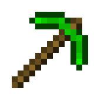

# Toeknee's Simple Tools Minecraft Mod - [Modrinth Page](https://modrinth.com/mod/toeknees-simple-tools)

This is a simple mod that adds simple tools to the game. No fuss.

**This mod is still a work in progress. Use at your own discretion.**

## Requirements to Run
* Minecraft 1.21+
* NeoForge 21.0.167+ or Fabric 0.16.0
* Architectury 13.0.6
* The NeoForge JAR or Fabric JAR.

## Additions

* Emerald Tools
* Quartz Tools
* Copper Tools
* More soon :)
